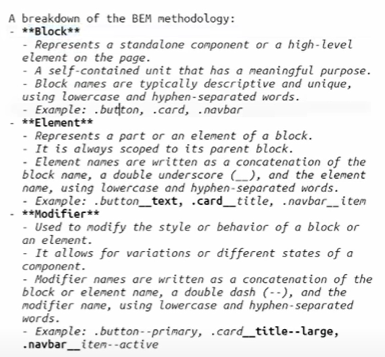

CSS stying using BEM.

BEM stands for Block, Element, Modifier, and it is a naming convention or methodology used in CSS to create a modular and maintainable codebase.
Block which holds everything (elements) inside and acts as a scope.
Element which acts as a special part of the component.
Modifier which adds additional styles to a specific element(s).

BEM helps to organize CSS classes by providing a clear and consistent structure for naming selectors.
